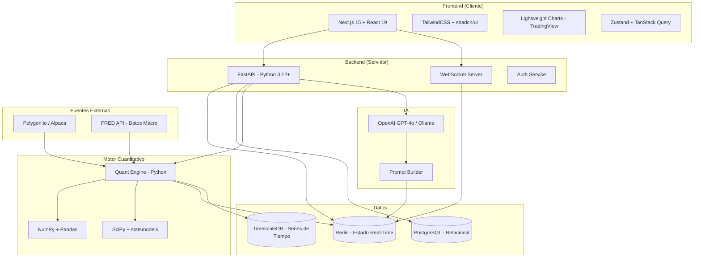
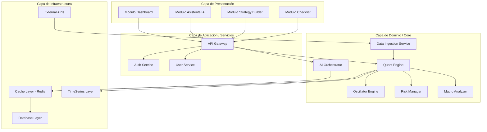
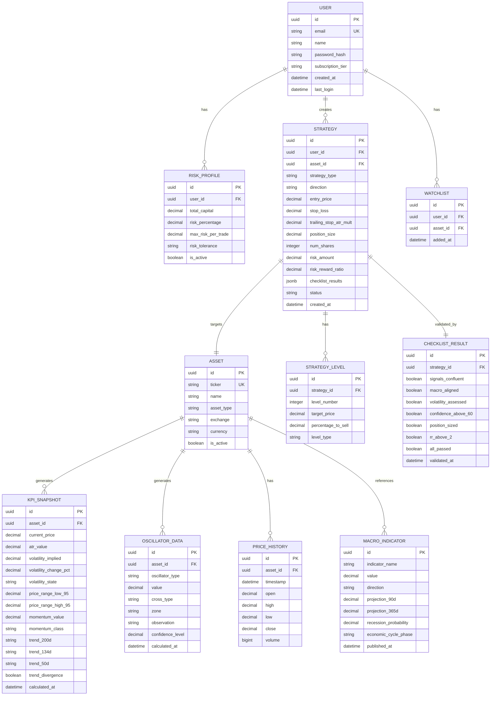
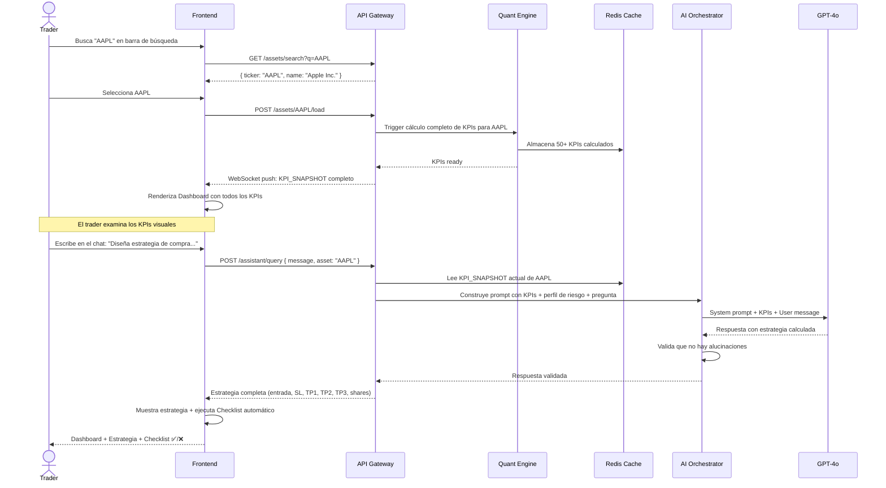

# HEAVEN COINT — Documentación Técnica Exhaustiva

> **Versión:** 2.0.0 | **Autor:** Claude Sonnet 4.6 — Rol: Ingeniero de Software Senior + Asesor Financiero NYSE  
> **Fecha:** 3 de abril de 2026 (última actualización) | **Clasificación:** Confidencial  
> **Repo:** `https://github.com/rbegacobas/heavenCoint.git`  
> **Fuente:** Análisis del archivo `heavenCoint.md` (transcripción del producto de referencia Orion One)

---

## 🧠 CEREBRO PERSISTENTE — Lee esto primero en cada sesión

### ¿Qué es Heaven Coint?

Heaven Coint es una **plataforma cuantitativa de trading profesional** que democratiza el acceso a herramientas de nivel institucional (osciladores propietarios, datos macro en tiempo real, asistente IA determinista, y constructor de estrategias con gestión de riesgo matemática). El objetivo es que traders retail operen con la misma ventaja informacional que fondos de inversión de Wall Street, **sin improvisar, con matemática pura**.

### Stack Tecnológico (Decisión Final)

| Capa | Tecnología | Versión Mínima |
|------|-----------|----------------|
| **Frontend** | Next.js (App Router) + React + TypeScript (strict) | Next.js 15, React 19 |
| **UI** | TailwindCSS + shadcn/ui | Tailwind 4 |
| **Gráficos** | Lightweight Charts (TradingView) | v4+ |
| **Estado frontend** | Zustand + TanStack Query | — |
| **Backend** | Python + FastAPI (async) | Python 3.12+, FastAPI 0.115+ |
| **Validación** | Pydantic v2 | v2.6+ |
| **BD Relacional** | PostgreSQL | 16+ |
| **BD Series de Tiempo** | TimescaleDB (extensión PostgreSQL) | 2.14+ |
| **Cache / Estado RT** | Redis | 7+ |
| **Tareas Async** | Celery + Redis broker | — |
| **ORM** | SQLAlchemy 2.0 + Alembic (migraciones) | — |
| **Market Data** | Polygon.io (acciones US) + Binance API (crypto) | — |
| **Datos Macro** | FRED API (Federal Reserve) | Gratuito |
| **LLM** | OpenAI GPT-4o (prod) / Ollama + Llama 3 (dev) | — |
| **Auth** | Auth.js (NextAuth) v5 | — |
| **Pagos** | Stripe | — |
| **Contenedores** | Docker + Docker Compose | — |
| **CI/CD** | GitHub Actions | — |
| **Monitoreo** | Prometheus + Grafana | — |
| **Reverse Proxy** | Traefik | — |

### Convenciones de Código

#### Idioma
- **Código fuente (variables, funciones, clases, endpoints):** Inglés obligatorio
- **Comentarios y docstrings:** Inglés
- **Documentación de usuario / UI:** Español (mercado LATAM) + Inglés
- **Commits:** Inglés, formato Conventional Commits (`feat:`, `fix:`, `docs:`, `test:`, `refactor:`, `chore:`)

#### Naming

| Contexto | Convención | Ejemplo |
|----------|-----------|---------|
| Python variables/funciones | `snake_case` | `calculate_position_size()` |
| Python clases | `PascalCase` | `QuantEngine`, `RiskManager` |
| Python constantes | `UPPER_SNAKE` | `MAX_RISK_PERCENTAGE = 0.03` |
| TypeScript variables/funciones | `camelCase` | `fetchKpiSnapshot()` |
| TypeScript componentes React | `PascalCase` | `<DashboardKpiCard />` |
| TypeScript types/interfaces | `PascalCase` | `type OscillatorData = {...}` |
| Archivos Python | `snake_case.py` | `quant_engine.py` |
| Archivos TypeScript | `kebab-case.tsx` | `kpi-card.tsx` |
| Archivos de componentes React | `kebab-case.tsx` | `dashboard-layout.tsx` |
| Endpoints API | `kebab-case` plural | `/api/v1/kpi-snapshots` |
| Tablas BD | `snake_case` plural | `kpi_snapshots`, `oscillator_data` |
| Variables de entorno | `UPPER_SNAKE` | `DATABASE_URL`, `REDIS_URL` |

#### Estructura de Carpetas (Actual — v1.5.0)

```
heavenCoint/
├── docs/                              # Documentación
│   ├── heavenCoint.md                 # Transcripción producto referencia
│   ├── HEAVEN_COINT_Documentacion_Tecnica_v1.0_by_copilot.md  # ← ESTE ARCHIVO
│   └── PHASE_1_DESIGN_ARTIFACTS.md    # Artefactos de diseño (esquema BD, API contracts)
├── frontend/                          # Next.js 15 + React 19
│   └── src/
│       ├── app/
│       │   ├── globals.css            # 24 design tokens (--color-hc-*)
│       │   ├── layout.tsx             # Root layout (Inter font, lang="es")
│       │   ├── dashboard/
│       │   │   ├── layout.tsx         # TickerBar + TopNav + Sidebars + Main
│       │   │   └── page.tsx           # Renderiza <MainContent />
│       │   └── (auth)/               # Login, Register
│       ├── components/
│       │   ├── ui/                    # shadcn/ui base
│       │   └── dashboard/            # ✅ 5 componentes desde Penpot
│       │       ├── ticker-bar.tsx     # Barra ticker scrollable (7 activos)
│       │       ├── top-nav.tsx        # Nav: logo + bell/moon + avatar
│       │       ├── left-sidebar.tsx   # Search + Analizar + Recientes
│       │       ├── main-content.tsx   # Grid KPIs (11 sub-componentes)
│       │       └── right-sidebar.tsx  # Builder/Pilot tabs + Chat IA
│       ├── hooks/                     # Custom hooks
│       ├── lib/                       # Utils, API client, constants
│       ├── stores/                    # Zustand stores
│       ├── types/                     # TypeScript types
│       └── __tests__/                 # Vitest tests
├── backend/                           # FastAPI + Python 3.12
│   ├── app/
│   │   ├── main.py                    # FastAPI app + routers
│   │   ├── api/v1/
│   │   │   ├── auth.py               # POST /register, /login
│   │   │   ├── health.py             # GET /health
│   │   │   ├── assets.py             # ✅ M1: búsqueda, carga de activos
│   │   │   ├── macro.py              # ✅ M1: indicadores macro FRED
│   │   │   └── kpis.py               # ✅ M2: KPIs con cache Redis
│   │   ├── core/                      # Config, security (JWT+bcrypt), deps
│   │   ├── models/
│   │   │   ├── user.py               # Fase 2
│   │   │   ├── asset.py              # ✅ M1
│   │   │   ├── price_history.py       # ✅ M1 (TimescaleDB)
│   │   │   ├── macro_indicator.py     # ✅ M1
│   │   │   └── kpi_snapshot.py        # ✅ M2
│   │   ├── schemas/
│   │   │   └── asset.py              # ✅ M1 Pydantic schemas
│   │   ├── services/
│   │   │   ├── market_data/          # ✅ M1 clients
│   │   │   │   ├── polygon_client.py  # Acciones US (Polygon.io)
│   │   │   │   ├── binance_client.py  # Crypto (Binance)
│   │   │   │   ├── fred_client.py     # Macro (FRED API)
│   │   │   │   └── ingestion.py       # Orquestador de ingesta
│   │   │   └── quant/                # ✅ M2 motor cuantitativo
│   │   │       └── __init__.py        # ATR, SMA, volatilidad, momentum
│   │   └── tests/                    # pytest (21 tests)
│   ├── alembic/                       # 3 migraciones aplicadas
│   ├── requirements.txt
│   └── requirements-dev.txt
├── infrastructure/
│   └── docker-compose.yml            # PostgreSQL+TimescaleDB + Redis
├── .github/workflows/                 # CI: lint + test en cada PR
├── .env.example                       # Variables documentadas
├── CLAUDE.md                          # Cerebro persistente (este doc es la fuente)
└── disenoDashboard.pen                # Diseño Penpot (fuente del dashboard)
```

### Reglas de Negocio Críticas (NO VIOLAR)

| # | Regla | Impacto si se viola |
|---|-------|---------------------|
| RN-1 | **Riesgo máximo por operación: 1% del capital** (configurable hasta 3%, NUNCA más) | El trader puede perder todo su capital (riesgo de ruina) |
| RN-2 | **Position Sizing = (Capital × Riesgo%) / (Entrada - StopLoss)** — Nunca ingresado manualmente, siempre calculado | Exposición incorrecta al mercado |
| RN-3 | **Stop Loss dinámico basado en ATR** (default: 2.5× ATR). Nunca un porcentaje fijo arbitrario | Stops saltan por ruido normal del mercado |
| RN-4 | **Take-profits escalonados**: TP1=33% a 1.5×ATR, TP2=33% a 2.5×ATR, TP3=34% trailing 2×ATR | Si se cierra todo en un punto, se pierde esperanza matemática |
| RN-5 | **Ratio R:R mínimo 1:2** — Si R:R < 2, la estrategia se marca "no recomendada" | Sistema no rentable a largo plazo |
| RN-6 | **El asistente IA SOLO responde con datos del activo cargado en Redis**. Si no hay dato, dice "no tengo información". NUNCA improvisa | Trader toma decisión con datos falsos |
| RN-7 | **Un solo activo a la vez** en el dashboard (restricción MVP) | Complejidad prematura |
| RN-8 | **Checklist de 6 puntos obligatorio** antes de validar una estrategia | Trader opera sin confirmación |
| RN-9 | **Datos financieros con precisión decimal**: acciones `DECIMAL(12,4)`, crypto `DECIMAL(18,8)` | Errores de redondeo = dinero perdido |
| RN-10 | **Timestamps siempre UTC** en la BD. Conversión a timezone del usuario solo en frontend | Bugs de horario durante market open/close |

### Comandos de Build / Test / Lint

```bash
# ─── BACKEND (desde /backend) ────────────────────────────
python -m venv .venv && source .venv/bin/activate    # Setup virtual env
pip install -r requirements.txt                       # Instalar deps
pip install -r requirements-dev.txt                   # Deps de desarrollo

uvicorn app.main:app --reload --port 8000             # Dev server
pytest                                                # Correr todos los tests
pytest --cov=app --cov-report=term-missing            # Tests + coverage
pytest -x -v                                          # Verbose, fail-fast
ruff check .                                          # Linting Python
ruff format .                                         # Formateo Python
mypy app/                                             # Type checking Python

alembic upgrade head                                  # Aplicar migraciones
alembic revision --autogenerate -m "descripción"      # Nueva migración

# ─── FRONTEND (desde /frontend) ──────────────────────────
pnpm install                                          # Instalar deps
pnpm dev                                              # Dev server (port 3000)
pnpm build                                            # Build producción
pnpm lint                                             # ESLint
pnpm type-check                                       # tsc --noEmit
pnpm test                                             # Vitest
pnpm test:coverage                                    # Tests + coverage

# ─── INFRAESTRUCTURA (desde /) ───────────────────────────
docker compose up -d                                  # Levantar todo (dev)
docker compose -f docker-compose.prod.yml up -d       # Producción
docker compose logs -f backend                        # Logs del backend
docker compose down                                   # Apagar todo

# ─── GIT ──────────────────────────────────────────────────
git add -A && git commit -m "feat: descripción"       # Commit convencional
git push origin main                                  # Push a remote
```

### 🚀 Cómo Levantar Todo (Desarrollo)

```bash
# ─── PASO 1: Bases de datos (desde la raíz del proyecto) ─────
docker compose up -d
# Levanta PostgreSQL+TimescaleDB (puerto 5432) y Redis (puerto 6379)
# Verificar: docker compose ps  →  ambos contenedores "healthy"

# ─── PASO 2: Backend (desde /backend) ────────────────────────
cd backend
source .venv/bin/activate
uvicorn app.main:app --reload --port 8000
# Verificar: curl http://localhost:8000/api/v1/health
# Respuesta esperada: {"status":"healthy","checks":{"database":"ok","redis":"ok"}}

# ─── PASO 3: Frontend (desde /frontend, en otra terminal) ────
cd frontend
pnpm dev
# Abre http://localhost:3000/dashboard
```

**Puertos en uso:**
| Servicio | Puerto | Contenedor/Proceso |
|----------|--------|--------------------|
| PostgreSQL + TimescaleDB | 5432 | `heavencoint-db` |
| Redis | 6379 | `heavencoint-redis` |
| FastAPI Backend | 8000 | uvicorn (local) |
| Next.js Frontend | 3000 | pnpm dev (local) |

### Estado del Proyecto

| Iteración | Estado | Fecha | Commit |
|-----------|--------|-------|--------|
| Fase 0 — Documentación + Git init | ✅ Completada | 2026-04-03 | `0674af3` |
| Fase 1 — Diseño (modelo datos, API contracts, validaciones) | ✅ Completada | 2026-04-03 | `d4b93e4` |
| Fase 2 — Scaffold (proyecto base, DB, auth, primer test) | ✅ Completada | 2026-04-03 | `e11df29` |
| Fase 3 — Build módulo a módulo (ciclo interno) | 🔶 En progreso | — | — |
| &nbsp;&nbsp;&nbsp;├─ M1 Data Ingestion (Polygon, Binance, FRED) | ✅ Completado | 2026-07-04 | `f1f511f` |
| &nbsp;&nbsp;&nbsp;├─ M2 Quant Engine (ATR, volatilidad, tendencias) | ✅ Completado | 2026-07-04 | `d7251a3` |
| &nbsp;&nbsp;&nbsp;├─ M4 Dashboard Frontend (UI estática desde Penpot + fixes layout) | ✅ Completado | 2026-04-03 | `d7251a3`+fixes |
| &nbsp;&nbsp;&nbsp;├─ **FASE B — Conectar Frontend↔Backend** (SIGUIENTE) | 🔶 En progreso | — | — |
| &nbsp;&nbsp;&nbsp;├─ M3 Oscillator Engine (NetBrute + Intenciones) | 🔲 Pendiente | — | — |
| &nbsp;&nbsp;&nbsp;├─ M5 Risk Manager (Position Sizing, stops) | 🔲 Pendiente | — | — |
| &nbsp;&nbsp;&nbsp;├─ M6 AI Orchestrator (prompt builder, LLM) | 🔲 Pendiente | — | — |
| &nbsp;&nbsp;&nbsp;├─ M7 Assistant Chat UI | 🔲 Pendiente | — | — |
| &nbsp;&nbsp;&nbsp;├─ M8 Strategy Builder + Checklist | 🔲 Pendiente | — | — |
| &nbsp;&nbsp;&nbsp;├─ M9 User Management | 🔲 Pendiente | — | — |
| &nbsp;&nbsp;&nbsp;└─ M10 Suscripciones + Pagos (Stripe) | 🔲 Pendiente | — | — |
| Fase 4 — Integración y testing E2E | 🔲 Pendiente | — | — |
| Fase 5 — Deploy staging + iteración | 🔲 Pendiente | — | — |

**Tests totales:** 22 (21 backend + 1 frontend) — Todos pasando ✅

**Fixes aplicados en M4 (sesión 2026-04-03):**
- `dashboard/layout.tsx`: `<main>` convertido a `flex flex-col` (bug raíz — sin esto nada scrolleaba)
- `main-content.tsx`: eliminadas alturas fijas `h-40`/`h-[260px]`, patrón scroll de dos capas
- `globals.css`: añadido `--color-hc-sidebar-accent: #6366F1`, corregido `--font-mono`
- Eliminado `sidebar.tsx` (archivo huérfano del scaffold Phase 2)

### Resumen de Implementación por Módulo

#### M1 — Data Ingestion (commit `f1f511f`, 16 archivos, +1111 líneas)

**Modelos SQLAlchemy creados:**
- `Asset` — activos financieros (ticker, nombre, tipo, exchange, moneda)
- `PriceHistory` — precios OHLCV históricos (TimescaleDB hypertable)
- `MacroIndicator` — indicadores macroeconómicos de FRED

**Clientes de APIs externas:**
- `PolygonClient` — Polygon.io para acciones US (OHLCV, snapshot, búsqueda)
- `BinanceClient` — Binance para criptomonedas (klines, precio actual)
- `FREDClient` — Federal Reserve para datos macro (GDP, CPI, desempleo, yield curve, recesión)

**Servicio de orquestación:**
- `IngestionService` — coordina ingesta completa de un activo: busca/crea en BD, descarga histórico, calcula KPIs

**Endpoints API:**
- `GET /api/v1/assets/search?q={query}` — búsqueda de activos
- `POST /api/v1/assets/{ticker}/load` — cargar activo completo
- `GET /api/v1/assets/{ticker}` — obtener activo por ticker
- `GET /api/v1/macro/indicators` — indicadores macro actuales
- `POST /api/v1/macro/refresh` — refrescar datos macro desde FRED

**Tests:** 6 tests unitarios e integración (`test_data_ingestion.py`)

**Migración Alembic:** `26414e5db68c` — tablas `assets`, `price_history`, `macro_indicators`

---

#### M2 — Quant Engine (commit `d7251a3`, 9 archivos, +2009 líneas)

**Modelo SQLAlchemy:**
- `KpiSnapshot` — snapshot completo de KPIs por activo (precios, ATR, volatilidad, confianza, momentum, tendencias, extra_kpis JSONB)

**Motor de cálculo (`services/quant/`):**
- ATR-14 (Average True Range de 14 períodos)
- SMA 50, 134, 200 (Simple Moving Averages)
- Detección de tendencia por SMA (UP/DOWN/SIDEWAYS)
- Volatilidad anualizada (desviación estándar × √252)
- Rango de confianza al 95% (precio ± 1.96 × σ diaria)
- Momentum (ROC de 14 períodos, clasificado como POSITIVE/NEGATIVE/NEUTRAL)
- Estado de volatilidad (EXPANSION si vol > 1.2× promedio, CONTRACTION si < 0.8×)

**Caching Redis:**
- Key: `kpi:{ticker}` con TTL de 60 segundos
- Lectura cache-first en endpoints GET

**Endpoints API:**
- `GET /api/v1/kpis/{ticker}` — obtener KPIs (cache Redis → BD si necesario)
- `POST /api/v1/kpis/{ticker}/refresh` — forzar recálculo completo

**Tests:** 10 tests unitarios e integración (`test_quant_engine.py`)

**Migración Alembic:** `57be196cbe30` — tabla `kpi_snapshots`

---

#### M4 — Dashboard Frontend (rediseño desde archivo Penpot)

**Origen del diseño:** Archivo `disenoDashboard.pen` (Penpot, 3,472 líneas JSON) con diseño profesional completo.

**Design Tokens extraidos (24 colores):**
```css
--color-hc-accent-blue: #3B82F6;     --color-hc-accent-cyan: #06B6D4;
--color-hc-accent-green: #22C55E;     --color-hc-accent-purple: #8B5CF6;
--color-hc-accent-red: #EF4444;       --color-hc-accent-yellow: #F59E0B;
--color-hc-bg-card: #FFFFFF;          --color-hc-bg-card-light: #F8F9FC;
--color-hc-bg-dark: #1B1F3B;          --color-hc-bg-input: #2A2D52;
--color-hc-bg-sidebar: #1E2148;       --color-hc-bg-ticker: #14172E;
--color-hc-border-dark: #2A2D52;      --color-hc-border-light: #E5E7EB;
--color-hc-btn-green: #22C55E;        --color-hc-btn-primary: #6366F1;
--color-hc-sidebar-accent: #6366F1;   --color-hc-text-dark: #1A1D3A;
--color-hc-text-muted: #A0A4B8;       --color-hc-text-secondary: #8B8FA3;
--color-hc-text-white: #FFFFFF;
```

**Componentes creados:**
| Componente | Archivo | Descripción |
|-----------|---------|-------------|
| `TickerBar` | `components/dashboard/ticker-bar.tsx` | Barra superior 32px con 7 activos en scroll (Bitcoin, GBP/JPY, HCA, PLTR, UBER, Gold, Visa) con % cambio coloreado |
| `TopNav` | `components/dashboard/top-nav.tsx` | Navegación 48px: "HeavenCoint v2.0" + iconos campana/luna + avatar "Fernando" |
| `LeftSidebar` | `components/dashboard/left-sidebar.tsx` | Sidebar izquierdo 220px: búsqueda, botón "Analizar con HeavenCoint", 6 análisis recientes con iconos check/x |
| `MainContent` | `components/dashboard/main-content.tsx` | Grid principal de KPIs: AssetHeader, SituationAnalysis, PriceLevels (R2/R1/Actual/S1), MarketStatus, Seasonality gauge, AtrCard, MomentumCard, ProjectionCard, VolatilityCard, DirectionalCard, NetBrutCard |
| `RightSidebar` | `components/dashboard/right-sidebar.tsx` | Sidebar derecho 320px: tabs HeavenBuilder/HeavenPilot + chat "Asistente Heaven" + barra de input |

**Layout del Dashboard:**
```
┌─────────────────────────────── TickerBar (32px, full-width) ──────────────────────────────┐
├─────────────────────────────── TopNav (48px, full-width) ─────────────────────────────────┤
├──────────┬────────────────────────────────────────────────────────────────┬───────────────┤
│ Left     │                    Main Content                               │    Right      │
│ Sidebar  │              (KPI Grid + Charts)                              │   Sidebar     │
│ (220px)  │                                                               │   (320px)     │
│          │  ┌──────────┐ ┌──────────┐ ┌──────────┐ ┌──────────┐        │               │
│ Search   │  │ Asset    │ │ Situation│ │ Price    │ │ Market   │        │ HeavenBuilder │
│ Analyze  │  │ Header   │ │ Analysis │ │ Levels   │ │ Status   │        │ HeavenPilot   │
│ Recent   │  └──────────┘ └──────────┘ └──────────┘ └──────────┘        │               │
│ analyses │  ┌──────────┐ ┌──────────┐ ┌──────────┐ ┌──────────┐        │ Chat          │
│          │  │ Season.  │ │ ATR      │ │ Momentum │ │ Project. │        │ Asistente     │
│          │  └──────────┘ └──────────┘ └──────────┘ └──────────┘        │ Heaven        │
│          │  ┌──────────┐ ┌──────────┐                                   │               │
│          │  │ Volat.   │ │ NetBrut  │                                   │ [Input bar]   │
│          │  └──────────┘ └──────────┘                                   │               │
├──────────┴────────────────────────────────────────────────────────────────┴───────────────┤
```

**Fuente:** Inter (reemplaza Geist/Geist_Mono del scaffold)

**Archivos modificados:**
- `frontend/src/app/globals.css` — 24 design tokens como CSS custom properties
- `frontend/src/app/layout.tsx` — fuente Inter, lang="es"
- `frontend/src/app/dashboard/layout.tsx` — layout completo con 5 componentes
- `frontend/src/app/dashboard/page.tsx` — renderiza `<MainContent />`
- `frontend/src/__tests__/dashboard.test.tsx` — actualizado para nueva UI

---

### Migraciones Alembic (3 aplicadas)

| ID | Descripción | Tablas |
|----|-------------|--------|
| `66ba73ca262f` | Create users table | `users` |
| `26414e5db68c` | Add assets, price_history, macro_indicators | `assets`, `price_history`, `macro_indicators` |
| `57be196cbe30` | Add kpi_snapshots | `kpi_snapshots` |

---

## 🗺️ MASTER PLAN DE EJECUCIÓN — v2.0

> **Principio rector:** El LLM nunca hace cálculos matemáticos. Python calcula, el LLM narra.  
> **Regla de oro:** Un endpoint / un componente / una migración a la vez. Nunca "hacer todo el módulo".  
> **Orden:** B → C → D → E → F → G → H. Cada fase desbloquea la siguiente.

---

### FASE B — Conectar Frontend ↔ Backend 🔶 EN PROGRESO

> **Objetivo:** Eliminar todos los datos hardcodeados del dashboard. Al escribir un ticker y pulsar "Analizar", el dashboard muestra datos reales desde la API.  
> **Resultado verificable:** AAPL real → ATR, volatilidad, momentum, tendencias reales en pantalla.

#### B1 — API Client + TypeScript Types
- **Archivo:** `frontend/src/lib/api.ts`
- Clase `ApiClient` con `baseUrl = process.env.NEXT_PUBLIC_API_URL || 'http://localhost:8000'`
- Métodos: `searchAssets(q: string)`, `loadAsset(ticker: string)`, `getKpiSnapshot(ticker: string)`, `getMacroIndicators()`
- Manejo de errores uniforme: `ApiError` con `status` y `message`
- **Archivo:** `frontend/src/types/api.ts`
- Interfaces TypeScript espejo de los schemas Pydantic del backend:
  ```ts
  interface KpiSnapshot { ticker, currentPrice, atrValue, volatilityImplied,
    volatilityState, volatilityChangePct, priceRangeLow95, priceRangeHigh95,
    momentumValue, momentumClass, trend200d, trend134d, trend50d,
    trendDivergence, calculatedAt }
  interface AssetSearchResult { ticker, name, assetType, exchange }
  interface MacroIndicators { gdp, cpi, unemploymentRate, recessionProbability,
    economicCyclePhase, yieldCurveSpread, fedFundsRate }
  ```

#### B2 — Zustand Store
- **Archivo:** `frontend/src/stores/asset-store.ts`
- Estado: `{ activeTicker: string | null, kpiSnapshot: KpiSnapshot | null, isLoading: boolean, error: string | null }`
- Acciones: `setActiveTicker`, `setKpiSnapshot`, `setLoading`, `setError`, `reset`
- **Nota:** Solo 1 activo a la vez (RN-7). Si cambia ticker → reset automático del snapshot anterior.

#### B3 — TanStack Query Setup + Hooks
- **Archivo:** `frontend/src/lib/query-client.ts` — instancia de `QueryClient` con defaults
- **Archivo:** `frontend/src/app/layout.tsx` — añadir `<QueryClientProvider>`
- **Archivo:** `frontend/src/hooks/use-kpi-snapshot.ts`
  - `useKpiSnapshot(ticker)` → `useQuery({ queryKey: ['kpi', ticker], queryFn: ... })`
  - `staleTime: 30_000` (30s), `refetchInterval: 60_000` (60s polling)
- **Archivo:** `frontend/src/hooks/use-asset-search.ts`
  - `useAssetSearch(query)` → `useQuery` con debounce 300ms

#### B4 — LeftSidebar: Search + Analyze Button funcionales
- **Archivo:** `frontend/src/components/dashboard/left-sidebar.tsx`
- Input controlado → llama `useAssetSearch` mientras el usuario escribe
- Dropdown de resultados bajo el input (máx 5 resultados)
- Al seleccionar o pulsar Enter → `setActiveTicker` en store
- Botón "Analizar con HeavenCoint" → llama `POST /api/v1/assets/{ticker}/load`
- Loading state en el botón mientras carga
- Counter "Te quedan X llamadas" — hardcodeado de momento (M9 lo conectará)
- Tests: `left-sidebar.test.tsx` — simular búsqueda + selección

#### B5 — MainContent: Datos Reales
- **Archivo:** `frontend/src/components/dashboard/main-content.tsx`
- Leer `kpiSnapshot` del store con `useAssetStore`
- Si `kpiSnapshot === null` → mostrar `<EmptyState />` (instrucciones para buscar activo)
- Si `isLoading` → mostrar skeletons en cada card
- Cada sub-componente recibe props tipadas (no lee store directamente → testeable)
- Reemplazar todos los valores hardcodeados:
  - `AssetHeader`: `{snapshot.ticker}`, fecha desde `calculatedAt`
  - `AtrCard`: `{snapshot.atrValue}`, badge dinámico según volatility state
  - `MomentumCard`: `{snapshot.momentumValue}`, `{snapshot.momentumClass}`
  - `VolatilityCard`: `{snapshot.volatilityImplied}`, `{snapshot.volatilityChangePct}`
  - `DirectionalCard`: `{snapshot.trend50d}`, `{snapshot.trend134d}`
  - `ProjectionCard`: `{snapshot.currentPrice}`, precio proyectado (currentPrice × 1.0425 placeholder hasta M3)
- **Nota crítica:** `SituationAnalysis`, `MarketStatus`, `NetBrutCard` usan datos de osciladores → mantienen mock data hasta que M3 esté listo. Marcar con `// TODO: M3` comment.

#### B6 — Estados Globales: Loading / Error / Empty
- **Archivo:** `frontend/src/components/dashboard/empty-state.tsx`
- Pantalla vacía cuando no hay activo cargado: icono + "Busca un activo para comenzar"
- **Archivo:** `frontend/src/components/dashboard/error-banner.tsx`
- Banner rojo superior: "⚠️ Datos no actualizados desde {timestamp}. No opere." (RN de caso de borde)
- Skeleton loaders en cada card (Tailwind `animate-pulse`)

#### B7 — Tests Actualizados
- Actualizar `dashboard.test.tsx`: testear con snapshot mockeado real (no datos hardcodeados)
- Añadir test de `EmptyState` cuando `kpiSnapshot === null`
- **Target:** ≥ 4 tests frontend pasando

---

### FASE C — M3 Oscillator Engine 🔲 PENDIENTE

> **Objetivo:** Implementar NetBrute e Intenciones con algoritmos propios. Mostrarlos en el dashboard.  
> **Algoritmos decididos:**
> - **NetBrute** = Chaikin Money Flow (CMF-14) × 100. Rango -100 a +100.  
>   Cruce alcista = CMF cruza de negativo a positivo. Cruce bajista = viceversa.  
>   Zonas: < -25 = sobreventa, -25 a 0 = bajista, 0 a 25 = alcista, > 25 = sobrecompra.  
>   Confianza = `min(100, abs(cmf_value) * 2 + 25)`
> - **Intenciones** = RSI(14) normalizado + signo de Momentum(14).  
>   Estado: RSI < 30 = BUY (pánico extremo), RSI > 70 = SELL (sobrecompra), 30-70 = HOLD.  
>   Zona: igual que RSI. Confianza = distancia al centro (50) normalizada × 2.

#### C1 — Modelo OscillatorData
- **Archivo:** `backend/app/models/oscillator_data.py`
- Campos: `id, asset_id (FK), oscillator_type (ENUM: NETBRUTE|INTENTIONS), value DECIMAL(10,4),`
  `cross_type (ENUM: BULLISH|BEARISH|NONE), zone (TEXT), confidence_level DECIMAL(5,2),`
  `observation (TEXT), calculated_at (TimescaleDB column)`
- Relación: `Asset.oscillator_data` (one-to-many)
- **Migración:** `alembic revision --autogenerate -m "add oscillator_data"`

#### C2 — NetBrute: Chaikin Money Flow
- **Archivo:** `backend/app/services/quant/oscillators.py`
- Función: `calculate_netbrute(highs, lows, closes, volumes, period=14) -> OscillatorResult`
- Fórmula CMF: `sum((2C-H-L)/(H-L) × V, N) / sum(V, N)`
- Detectar cruce: comparar sign(cmf[-1]) vs sign(cmf[-2])
- Zona automática según umbrales definidos
- Observación: texto descriptivo determinista (no IA) según zona + cruce
- Tests: 5 tests unitarios con datos sintéticos conocidos

#### C3 — Intenciones: RSI + Momentum
- **Función:** `calculate_intentions(closes, rsi_period=14, momentum_period=14) -> OscillatorResult`
- RSI Wilder: `100 - (100 / (1 + avg_gain/avg_loss))`
- Estado BUY/SELL/HOLD según umbrales
- Observación determinista según estado
- Tests: 5 tests unitarios

#### C4 — Integrar en QuantEngine
- Llamar a ambos osciladores desde `calculate_kpis()`
- Persistir en `oscillator_data` tabla
- Incluir en snapshot Redis: `kpi:{ticker}` → añadir campos `netbrute` y `intentions`

#### C5 — Endpoint Osciladores
- **Archivo:** `backend/app/api/v1/oscillators.py`
- `GET /api/v1/oscillators/{ticker}` → retorna NetBrute + Intenciones + divergencia
- Divergencia: `netbrute.cross_type != intentions.state` → `divergence: true`
- Actualizar `/api/v1/kpis/{ticker}` para incluir osciladores en respuesta

#### C6 — Frontend: NetBrut y MarketStatus con datos reales
- Actualizar `main-content.tsx`: `NetBrutCard` y `MarketStatus` leen osciladores del store
- Añadir `oscillatorData` al Zustand store
- Actualizar `useKpiSnapshot` para incluir osciladores
- Eliminar todos los `// TODO: M3` comments

---

### FASE D — M5 Risk Manager 🔲 PENDIENTE

> **Objetivo:** El sistema calcula position sizing, SL y TPs matemáticamente. **Python calcula, no el LLM.**  
> **Fórmulas (RN-2, RN-3, RN-4):**
> ```
> SL = entry - (ATR × 2.5)
> TP1 = entry + (ATR × 1.5) → vender 33%
> TP2 = entry + (ATR × 2.5) → vender 33%
> TP3 = trailing stop: max_price - (ATR × 2.0) → mantener 34%
> N_shares = (capital × risk_pct) / (entry - SL)
> RR = (TP2 - entry) / (entry - SL)  → debe ser ≥ 2.0
> ```

#### D1 — RiskManager Service
- **Archivo:** `backend/app/services/risk_manager.py`
- Clase `RiskManager` con método `calculate_strategy(ticker, direction, capital, risk_pct) -> StrategyResult`
- `StrategyResult`: entry, sl, tp1, tp2, tp3_trailing_mult, n_shares, risk_amount, rr_ratio, is_recommended
- Validaciones: `risk_pct ≤ 0.03` (RN-1), `rr_ratio ≥ 2.0` o marcar `is_recommended=False` (RN-5)
- Tests: 8 tests unitarios (incluyendo edge cases: capital insuficiente, ATR=0, RR<2)

#### D2 — StrategyResult Model + Migration
- **Archivo:** `backend/app/models/strategy.py` — tabla `strategies`
- **Migración:** `alembic revision --autogenerate -m "add strategies"`

#### D3 — Endpoint Strategy
- **Archivo:** `backend/app/api/v1/strategies.py`
- `POST /api/v1/strategies/calculate` → body: `{ticker, direction, capital, risk_pct}`
- Respuesta: `StrategyResult` completo con todos los niveles
- `GET /api/v1/strategies/{ticker}/last` → última estrategia calculada para ese activo

#### D4 — Frontend: Strategy Display
- **Archivo:** `frontend/src/components/dashboard/strategy-card.tsx`
- Muestra entrada, SL, TP1/TP2/TP3, N acciones, RR ratio
- Badge "RECOMENDADA" (verde) / "NO RECOMENDADA" (rojo) según RR
- Conectar desde RightSidebar tab "HeavenBuilder"

---

### FASE E — M6 AI Orchestrator 🔲 PENDIENTE

> **Objetivo:** Asistente que JAMÁS improvisa. Lee KPIs de Redis, construye prompt determinista, el LLM solo narra.  
> **Regla fundamental:** El system prompt incluye: *"NO tienes acceso a internet. Responde SOLO usando los datos del JSON proporcionado. Si un dato no está en el JSON, di 'no tengo esa información'."*

#### E1 — OpenAI/Ollama Client
- **Archivo:** `backend/app/services/ai/llm_client.py`
- Abstracción `LLMClient` con implementaciones `OpenAIClient` y `OllamaClient`
- Selección por `settings.LLM_PROVIDER` (env var): `openai` o `ollama`
- Dev default: Ollama + Llama 3 (costo $0). Prod: OpenAI GPT-4o.

#### E2 — Prompt Builder
- **Archivo:** `backend/app/services/ai/prompt_builder.py`
- `build_system_prompt(kpi_snapshot: dict, user_capital: float, risk_pct: float) -> str`
- Inyecta TODO el KPI snapshot como JSON estructurado en el system prompt
- Incluye instrucciones estrictas anti-improvisación + reglas de negocio
- `build_user_message(raw_question: str) -> str` — sanitización de input

#### E3 — Response Validator
- **Archivo:** `backend/app/services/ai/response_validator.py`
- Extrae números del texto de respuesta del LLM
- Cruza cada número con los KPIs en Redis: si difiere >1% → flag como posible alucinación
- Si hay alucinación detectada → regena o responde con disclaimer

#### E4 — Assistant Endpoint
- **Archivo:** `backend/app/api/v1/assistant.py`
- `POST /api/v1/assistant/query` → body: `{ticker, message, capital?, risk_pct?}`
- Flujo: Redis KPIs → PromptBuilder → LLM → ResponseValidator → Response
- Streaming con SSE (`StreamingResponse`) para respuesta progresiva
- Tests: 5 tests (mock LLM) verificando que context injection funciona y anti-improvisación activa

#### E5 — Frontend: Chat Funcional
- **Archivo:** `frontend/src/components/dashboard/right-sidebar.tsx`
- Input real → `POST /api/v1/assistant/query`
- Historial de mensajes en Zustand store (`chatMessages: Message[]`)
- Streaming display (SSE o polling cada 500ms)
- Contador de mensajes restantes (hardcodeado 400 → M9 lo conecta)
- Disable input mientras `activeTicker === null`

---

### FASE F — M8 Strategy Builder + Checklist 🔲 PENDIENTE

> **Objetivo:** El tab "HeavenBuilder" es funcional: genera estrategia completa + ejecuta checklist 6 puntos automáticamente.

#### F1 — Checklist Logic (Backend)
- **Archivo:** `backend/app/services/checklist.py`
- `run_checklist(kpi_snapshot, oscillators, strategy_result) -> ChecklistResult`
- 6 puntos (todos automáticos, ninguno manual):
  1. NetBrute e Intenciones misma dirección → ✅/⚠️
  2. Proyección macro 90d alineada con dirección → ✅/⚠️
  3. Volatilidad evaluada y stops ajustados → ✅ siempre (stops son ATR-based)
  4. Confianza de ambos osciladores > 60% → ✅/⚠️
  5. Position sizing calculado (N_shares > 0) → ✅/❌
  6. RR ratio ≥ 1:2 → ✅/❌ (❌ = bloqueo, no solo advertencia)
- `POST /api/v1/strategies/checklist`

#### F2 — HeavenBuilder Tab UI
- **Archivo:** `frontend/src/components/dashboard/heaven-builder.tsx`
- Formulario: capital ($), risk_pct (slider 0.5%-3%), dirección (LONG/SHORT)
- Botón "Generar Estrategia" → `POST /api/v1/strategies/calculate`
- Muestra: StrategyCard + ChecklistCard lado a lado
- ChecklistCard: 6 filas con ✅/⚠️/❌ y texto explicativo por punto
- Si algún ❌ → botón "Operar" deshabilitado con tooltip explicando por qué

---

### FASE G — M9 User Management 🔲 PENDIENTE

> Depende de: Auth (ya scaffold en Phase 2) + todos los módulos anteriores.

- Perfil de riesgo del usuario (capital, risk_pct, tolerancia)
- Historial de análisis (qué activos analizó, qué estrategias generó)
- Watchlist (activos favoritos)
- Contador real de llamadas al asistente (por tier de suscripción)
- `GET /api/v1/users/me/profile` | `PUT /api/v1/users/me/risk-profile`

---

### FASE H — M10 Suscripciones + Pagos 🔲 PENDIENTE

> Depende de: M9 (usuarios con perfiles). MVP de monetización.

- Stripe Checkout + webhooks
- Tiers: Free (80 análisis/mes, 400 mensajes asistente) | Pro ($X/mes, ilimitado) | Enterprise
- Feature flags por tier: algunos KPIs solo en Pro
- `POST /api/v1/subscriptions/create-checkout-session`

---

### FASE I — Deploy Staging 🔲 PENDIENTE

> Gate de calidad: E2E-1 pasando (buscar activo → ver dashboard con datos reales).

- `docker-compose.prod.yml` con todos los servicios
- Variables de entorno en `.env.production`
- Deploy en Hetzner VPS (recomendado para MVP: €20/mes)
- SSL via Traefik + Let's Encrypt
- GitHub Actions: deploy automático a staging en merge a `main`

---

### Decisiones de Algoritmos (No cambiar sin documentar motivo)

| Algoritmo | Decisión | Justificación |
|-----------|----------|---------------|
| **NetBrute** | Chaikin Money Flow (14p) × 100 | Mide flujo real de dinero desde OHLCV+Volume. Open source, probado, calculable desde datos que ya tenemos. Produce -100/+100 igual que el original |
| **Intenciones** | RSI(14) + signo Momentum(14) | RSI mide presión compradora/vendedora (psicología). Momentum confirma dirección. Combinados dan BUY/SELL/HOLD con nivel de confianza |
| **ATR** | Wilder 14 períodos | Estándar de la industria, ya implementado en M2 |
| **SL dinámico** | 2.5 × ATR | Del video de Fernando. Default configurable, nunca porcentaje fijo |
| **TPs** | 33%/33%/34% en 1.5x/2.5x ATR + trailing | Del video, confirmado en todas las IAs. RN-4 |
| **LLM calc** | **Python calcula, LLM narra** | Insight crítico: el LLM nunca hace matemáticas. Solo explica resultados calculados por Python |

---

### Invariantes Técnicas (NUNCA violar)

```
1. Frontend sin QueryClientProvider → crashea. Siempre envolver en layout.tsx.
2. El KPI snapshot en Redis tiene TTL=60s. Nunca leer DB directamente en GET /kpis.
3. risk_pct > 0.03 → ValidationError en backend. No negociable (RN-1).
4. LLM no recibe preguntas sin snapshot de Redis inyectado en system prompt.
5. Timestamps siempre UTC en BD. Conversión a local solo en frontend.
6. Un activo a la vez. Si cambia ticker → invalidar todo el store Zustand.
7. Decimal(12,4) para acciones, Decimal(18,8) para crypto. No usar float.
```

---

## PLAN MAESTRO — Fases de Iteración

### Fase 1 — Diseñar antes de codear (Plan Mode)

> **Objetivo:** Producir los artefactos de diseño que guiarán toda la implementación. NO se toca código.

**Entregables:**

1. **Esquema de base de datos completo**
   - Todas las tablas con tipos exactos (PostgreSQL + TimescaleDB)
   - Relaciones (FK), índices, constraints
   - Particionamiento de TimescaleDB para `price_history`
   - SQL de migración inicial

2. **Contratos de API (OpenAPI)**
   - Todos los endpoints REST + WebSocket
   - Payloads de request (Pydantic schemas)
   - Respuestas con códigos HTTP
   - Autenticación requerida por endpoint
   - Rate limits por tier

3. **Reglas de validación por entidad**
   - Rangos válidos para cada campo numérico
   - Enums y valores permitidos
   - Lógica de validación cross-field
   - Mensajes de error estandarizados

4. **Diagrama de secuencia de flujos críticos**
   - Flujo: cargar activo → ver dashboard
   - Flujo: pedir estrategia al asistente
   - Flujo: checklist pre-operación

**Protocolo:** Revisar cada artefacto manualmente. Corregir. Solo avanzar cuando todo esté aprobado.

### Fase 2 — Scaffold del proyecto

> **Objetivo:** Proyecto funcional con estructura base, DB conectada, auth, linting, y 1 test verde.

**Entregables:**

1. **Backend**
   - FastAPI inicializado con estructura de carpetas
   - Conexión a PostgreSQL + TimescaleDB + Redis
   - Auth básico (registro, login, JWT)
   - Health check endpoint (`GET /api/v1/health`)
   - Alembic configurado con primera migración (tabla `users`)
   - ruff + mypy configurados
   - pytest con 1 test pasando (health check)

2. **Frontend**
   - Next.js 15 inicializado con App Router
   - TailwindCSS + shadcn/ui configurados
   - Layout base (sidebar + main area)
   - Página de login/registro conectada a backend
   - ESLint + TypeScript strict
   - Vitest con 1 test pasando

3. **Infraestructura**
   - `docker-compose.yml` con PostgreSQL, TimescaleDB, Redis
   - `.env.example` con todas las variables documentadas
   - `.gitignore` completo
   - GitHub Actions: CI básico (lint + test en cada PR)

4. **Git**
   - Commit inicial con toda la estructura
   - Branch strategy: `main` (producción) + `develop` (desarrollo) + feature branches

### Fase 3 — Build módulo a módulo (Ciclo Interno)

> **Objetivo:** Construir cada módulo siguiendo un ciclo estricto de 5 pasos.

**Ciclo por módulo:**

```
┌─────────────────────────────────────────────────────┐
│                 CICLO INTERNO                        │
│                                                     │
│  ① PLAN ──▶ ② CODE ──▶ ③ TEST ──▶ ④ REVIEW ──▶ ⑤ COMMIT │
│     │          │          │           │             │
│     │          │          │           │             │
│  Describir  Código      Unit +      Simplificar   git commit  │
│  módulo,    incremental Integration  si es         solo si     │
│  aprobar    (1 endpoint, tests       necesario     tests pasan │
│  approach   1 component              ("hacé la     + review OK │
│             a la vez)                solución                  │
│                                      elegante")               │
└─────────────────────────────────────────────────────┘
```

**Orden de construcción de módulos (priorizado por dependencias):**

| Orden | Módulo | Depende de | Sprint |
|-------|--------|-----------|--------|
| M1 | ✅ **Data Ingestion** (Polygon.io, Binance, FRED) | Infraestructura (Redis, TimescaleDB) | Sprint 1-2 |
| M2 | ✅ **Quant Engine** (ATR, volatilidad, tendencias, momentum) | M1 (datos normalizados) | Sprint 2-3 |
| M3 | 🔲 **Oscillator Engine** (NetBrute + Intenciones) | M2 (KPIs base calculados) | Sprint 3-4 |
| M4 | ✅ **Dashboard Frontend** (KPI cards, gráficos, búsqueda activos) | M2, M3 (KPIs en Redis) | Sprint 3-5 |
| M5 | 🔲 **Risk Manager** (Position Sizing, stops, take-profits) | M2 (ATR disponible) | Sprint 4-5 |
| M6 | 🔲 **AI Orchestrator** (prompt builder, LLM call, post-validación) | M2, M3, M5 (todo el context) | Sprint 5-6 |
| M7 | 🔲 **Assistant Chat UI** | M6 (API del asistente) | Sprint 6-7 |
| M8 | 🔲 **Strategy Builder + Checklist** | M5, M6 (riesgo + IA) | Sprint 7-8 |
| M9 | 🔲 **User Management** (perfil riesgo, watchlist, histórico) | Auth (Fase 2) | Sprint 8-9 |
| M10 | 🔲 **Suscripciones + Pagos** (Stripe) | M9 (usuarios) | Sprint 9-10 |

**MVP 1 = M1 a M8** (plataforma funcional completa sin pagos)  
**MVP 2 = M9 + M10** (monetización)

**Regla de oro:** NUNCA pedir "hacé todo el módulo" de golpe. Un endpoint, un componente, una migración a la vez.

### Fase 4 — Integración y Testing E2E

> **Objetivo:** Verificar que los módulos trabajan juntos en flujos completos.

**Tests E2E críticos:**

| # | Flujo | Módulos involucrados |
|---|-------|---------------------|
| E2E-1 | Buscar AAPL → cargar activo → ver 50+ KPIs en dashboard | M1, M2, M3, M4 |
| E2E-2 | Pedir estrategia al asistente → recibir entrada/SL/TP/posición | M2, M3, M5, M6, M7 |
| E2E-3 | Estrategia generada → checklist automático → 6/6 ✅ | M5, M6, M8 |
| E2E-4 | Registro → login → configurar perfil riesgo → operar | Auth, M9, M5 |
| E2E-5 | Datos stale (API caída) → banner de advertencia → bloqueo de operación | M1, M4 |
| E2E-6 | Prompt injection al asistente → respuesta sanitizada | M6, M7 |

**Herramienta:** Playwright (browser E2E) + httpx (API E2E)

### Fase 5 — Deploy Staging e Iteración

> **Objetivo:** Desplegar cada MVP a staging lo antes posible. No esperar a "tener todo".

**Calendario de deploys:**

| Deploy | Contenido | Gate de calidad |
|--------|-----------|-----------------|
| **Deploy 0** | Scaffold + health check + landing page | CI verde |
| **Deploy 1** | Dashboard con datos reales de 1 activo (AAPL) | E2E-1 pasando |
| **Deploy 2** | + Asistente IA funcional con estrategias | E2E-1 + E2E-2 pasando |
| **Deploy 3** | + Checklist + gestión de riesgo completa | E2E-1 a E2E-5 pasando |
| **Deploy 4 (MVP 1)** | Plataforma completa sin pagos | Todos los E2E pasando |
| **Deploy 5 (MVP 2)** | + Suscripciones Stripe | + tests de pagos |

**Estrategia:** Blue-Green deployment. Deployar SOLO fuera de horario de mercado NYSE (antes 9:00 AM ET o después 5:00 PM ET).

---

## Índice de Documentación Técnica

0. [Cerebro Persistente](#-cerebro-persistente--lee-esto-primero-en-cada-sesión)
1. [Análisis Profundo del Producto](#1-análisis-profundo-del-producto)
2. [Ciclo de Vida del Diseño del Software (SDLC)](#2-ciclo-de-vida-del-diseño-del-software-sdlc)
3. [Stack Tecnológico Recomendado](#3-stack-tecnológico-recomendado)
4. [Arquitectura de Módulos](#4-arquitectura-de-módulos)
5. [Modelo de Datos](#5-modelo-de-datos)
6. [Flujos de Trabajo Clave](#6-flujos-de-trabajo-clave)
7. [Requisitos No Funcionales](#7-requisitos-no-funcionales)
8. [Recomendaciones Estratégicas](#8-recomendaciones-estratégicas)

---

## 1. Análisis Profundo del Producto

### 1.1 Propósito Central

Heaven Coint es una **plataforma cuantitativa de trading profesional** que busca replicar y superar las capacidades descritas en el sistema de referencia (Orion One). Su propósito es **democratizar el acceso a herramientas de análisis de nivel institucional**, permitiendo que traders retail operen con la misma ventaja informacional que fondos de inversión y mesas institucionales de Wall Street.

El sistema se fundamenta en **cuatro pilares arquitectónicos**:

| Pilar | Función | Componente Técnico |
|-------|---------|-------------------|
| **1. Datos Macro en Tiempo Real** | Probabilidad de recesión, fase del ciclo económico, proyecciones 90-365 días, volatilidad implícita diaria | Motor de Ingesta + Modelos Estadísticos |
| **2. Osciladores Propietarios** | NetBrute (flujo institucional de órdenes) + Intenciones (psicología de masa) | Motor Cuantitativo con algoritmos propios |
| **3. Asistente IA Determinista** | Respuestas calculadas exclusivamente con KPIs del activo cargado — jamás improvisa | LLM con Context Window controlado |
| **4. Constructor de Estrategias** | Confluencia de señales, stops dinámicos ATR, take-profits escalonados, position sizing matemático | Motor de Riesgo + Strategy Builder |

### 1.2 Problema que Resuelve

Desde mi experiencia como asesor financiero en la NYSE, identifico **tres problemas críticos** que este software ataca frontalmente:

**Problema 1 — La ilusión del análisis por IA generativa:**
Los traders retail han adoptado masivamente ChatGPT, Gemini y similares como "asesores financieros". Estas herramientas generan texto convincente pero **no tienen acceso a datos financieros estructurados en tiempo real**. No conocen el precio actual, la volatilidad implícita semanal, ni el flujo de órdenes institucionales. Experimentos con capital real demostraron que todas las IAs generativas **perdieron dinero sin excepción** al operar mercados.

**Problema 2 — La brecha institutional-retail:**
En la NYSE, las mesas institucionales operan con sistemas cuantitativos que cuestan millones: terminales Bloomberg ($24,000/año), sistemas de order flow como Bookmap, datos Level II en tiempo real. El trader retail promedio no tiene acceso a esta información. Heaven Coint cierra esta brecha ofreciendo KPIs institucionales a precio accesible.

**Problema 3 — La gestión de riesgo emocional:**
El 90% de traders retail pierden dinero porque operan por impulso: sin calcular tamaño de posición, sin stops dinámicos, sin take-profits escalonados. Heaven Coint **sistematiza la gestión de riesgo** con matemática pura: regla del 1%, Position Sizing basado en ATR, ratio R:R mínimo 1:2.

### 1.3 Usuarios Objetivo y sus Necesidades

| Segmento | Experiencia | Dolor Principal | Necesidad que Cubre |
|----------|-------------|-----------------|---------------------|
| **Trader Retail en Formación** | 0-2 años | Pierde dinero siguiendo señales de IAs genéricas o "gurús" | Sistema educativo que enseñe trading cuantitativo real |
| **Trader Retail Intermedio** | 2-5 años | Tiene conocimiento técnico pero carece de edge cuantitativo | Osciladores propietarios + datos institucionales |
| **Trader Retail Avanzado** | 5+ años | Opera con herramientas dispersas, no tiene sistema unificado | Plataforma todo-en-uno: datos + IA + estrategias + riesgo |
| **Swing/Position Trader** | Variable | Necesita contexto macroeconómico para operaciones de días/semanas | Proyecciones macro 90-365 días, probabilidad de recesión |
| **Formador/Educador** | 10+ años | Necesita herramientas para demostrar conceptos a estudiantes | Dashboard visual con +50 KPIs en tiempo real |

### 1.4 Valor Diferencial

Comparativa directa contra el ecosistema competitivo actual:

| Característica | ChatGPT/Gemini | TradingView | Bloomberg Terminal | **Heaven Coint** |
|---------------|---------------|-------------|-------------------|-----------------|
| Datos en tiempo real | ❌ | ✅ | ✅ | ✅ |
| Osciladores propietarios (NetBrute/Intenciones) | ❌ | ❌ | ❌ | ✅ |
| Asistente IA que no improvisa | ❌ | ❌ | ❌ | ✅ |
| Constructor de estrategias con confluencia | ❌ | Parcial | ✅ | ✅ |
| Gestión de riesgo cuantitativa integrada | ❌ | ❌ | Parcial | ✅ |
| Accesible para retail (<$100/mes) | ✅ | ✅ | ❌ ($2K/mes) | ✅ |
| Checklist pre-operación | ❌ | ❌ | ❌ | ✅ |

**Ventajas exclusivas:**
1. **Oscilador NetBrute**: Mide flujo institucional de órdenes (dinero entrando/saliendo). Matemática pura, no opiniones.
2. **Oscilador de Intenciones**: Anticipa movimientos midiendo psicología de masa antes de que se ejecuten.
3. **Detección de divergencias**: Cuando NetBrute e Intenciones divergen, señala oportunidades que solo el "dinero inteligente" identifica.
4. **Asistente IA Context-Bound**: Entrenado solo con KPIs del activo cargado; cada respuesta es un cálculo, no una opinión.
5. **Position Sizing automático**: Calcula el número exacto de acciones/contratos según capital, riesgo y ATR.

### 1.5 Alcance Actual y Potencial de Crecimiento

```
┌──────────────────────────────────────────────────────────────────────┐
│                    ROADMAP DE CRECIMIENTO                            │
├──────────────┬──────────────────────┬────────────────────────────────┤
│   FASE       │   CONTENIDO          │   ACTIVOS                     │
├──────────────┼──────────────────────┼────────────────────────────────┤
│ MVP          │ Dashboard + IA +     │ Acciones US (NYSE/NASDAQ)      │
│ (0-6 meses)  │ Estrategias          │ + Top 10 Criptomonedas         │
├──────────────┼──────────────────────┼────────────────────────────────┤
│ Fase 2       │ + Backtesting        │ + Forex Majors                 │
│ (6-12 meses) │ + Alertas RT         │ + ETFs Principales             │
│              │ + Multi-activo       │ + Commodities (Oro, Petróleo)  │
├──────────────┼──────────────────────┼────────────────────────────────┤
│ Fase 3       │ + API Brokers        │ + Futuros                      │
│ (12-24 meses)│ + Ejecución semi-auto│ + Opciones                     │
│              │ + Marketplace        │ + Mercados emergentes          │
│              │   estrategias        │                                │
├──────────────┼──────────────────────┼────────────────────────────────┤
│ Fase 4       │ + Trading algorítmico│ + Mercados globales            │
│ (24+ meses)  │ + Portfolio mgmt     │ + Pre-market/After-hours       │
│              │ + Mobile apps        │ + Dark pools data              │
└──────────────┴──────────────────────┴────────────────────────────────┘
```

---

## 2. Ciclo de Vida del Diseño del Software (SDLC)

### 2.1 Fase de Requerimientos

#### 2.1.1 Requerimientos Funcionales (RF)

| ID | Requerimiento | Prioridad | Complejidad |
|----|---------------|-----------|-------------|
| RF-001 | Dashboard con +50 KPIs profesionales por activo cargado (precio, ATR, volatilidad, rangos, tendencias, momentum) | CRÍTICA | Alta |
| RF-002 | Oscilador NetBrute: valor numérico, tipo de cruce (alcista/bajista), zona, observación, nivel de confianza (%) | CRÍTICA | Muy Alta |
| RF-003 | Oscilador de Intenciones: estado (BUY/SELL/HOLD), zona (alcista/bajista/neutral), observación, nivel de confianza (%) | CRÍTICA | Muy Alta |
| RF-004 | Proyección económica a 90 y 365 días: dirección (positiva/negativa) + porcentaje de variación esperada | ALTA | Alta |
| RF-005 | Volatilidad implícita: valor diario, variación % vs semana anterior, estado (expansión/contracción) | CRÍTICA | Media |
| RF-006 | ATR actual + rango de precios con 95% de confianza (min/max estimados) | ALTA | Media |
| RF-007 | Asistente IA que analiza solo KPIs del activo cargado. No busca en internet. No improvisa. Solicita especificidad ante preguntas ambiguas | CRÍTICA | Muy Alta |
| RF-008 | Constructor de estrategias: entrada, stop loss dinámico (ATR × multiplicador configurable), take-profits escalonados (33%/33%/34% por defecto), trailing stop | CRÍTICA | Alta |
| RF-009 | Gestión de riesgo cuantitativa: regla del 1% de capital, cálculo exacto de position sizing, ratio R:R mínimo 1:2 | CRÍTICA | Media |
| RF-010 | Checklist pre-operación de 6 puntos: (1) confluencia señales, (2) proyección alineada, (3) volatilidad evaluada, (4) confianza >60%, (5) posición calculada, (6) R:R ≥ 1:2 | ALTA | Baja |
| RF-011 | Probabilidad de recesión calculada con modelos estadísticos (%) | ALTA | Alta |
| RF-012 | Tendencias múltiples: 200d, 134d, 50d con detección de divergencia entre ellas | ALTA | Media |
| RF-013 | Momentum: valor numérico con clasificación automática (positivo/negativo/neutral) | MEDIA | Baja |
| RF-014 | Restricción de activo único: el sistema analiza un activo a la vez | CRÍTICA | Baja (restricción de diseño) |
| RF-015 | Explicación de conceptos financieros bajo demanda (esperanza matemática, drawdown, riesgo de ruina, etc.) | MEDIA | Baja |
| RF-016 | Selección de activo por símbolo (ticker) con búsqueda y carga instantánea | ALTA | Media |

#### 2.1.2 Requerimientos No Funcionales (RNF)

| ID | Requerimiento | Métrica |
|----|---------------|---------|
| RNF-001 | Latencia de actualización de KPIs en dashboard | < 500ms |
| RNF-002 | Tiempo de respuesta del asistente IA | < 5 segundos |
| RNF-003 | Carga del dashboard completo al seleccionar activo | < 3 segundos |
| RNF-004 | Disponibilidad del sistema durante horario de mercado (NYSE: L-V, 9:30-16:00 ET) | 99.9% |
| RNF-005 | Precisión en cálculos financieros (ATR, Position Sizing) | Error < 0.01% |
| RNF-006 | Criptografía de datos de usuario y configuraciones de riesgo | AES-256 en reposo, TLS 1.3 en tránsito |
| RNF-007 | Soporte concurrente de usuarios | ≥ 1,000 simultáneos en MVP |
| RNF-008 | Cero alucinaciones del asistente IA: nunca debe inventar datos o KPIs | Validation rate 100% |

### 2.2 Fase de Diseño

**Arquitectura propuesta:** Arquitectura Orientada a Eventos (EDA) + Backend-for-Frontend (BFF)

Justificación desde la perspectiva de la NYSE: los mercados financieros son inherentemente event-driven. Cada tick, cada orden, cada cambio en el order book es un evento. La arquitectura debe reflejar esta naturaleza.

```
┌─────────────────────────────────────────────────────────┐
│                   ARQUITECTURA DE ALTO NIVEL             │
│                                                         │
│   ┌───────────┐     ┌──────────────┐    ┌───────────┐  │
│   │  Market    │────▶│  Event Bus   │───▶│  Quant    │  │
│   │  Data APIs │     │  (Redis      │    │  Engine   │  │
│   └───────────┘     │   Streams)   │    └─────┬─────┘  │
│                     └──────┬───────┘          │        │
│                            │            ┌─────▼─────┐  │
│   ┌───────────┐           │            │  State     │  │
│   │  Frontend  │◀──────────┤            │  Store     │  │
│   │   (SPA)   │     ┌─────▼─────┐     │  (Redis)   │  │
│   └───────────┘     │  API       │     └─────┬─────┘  │
│                     │  Gateway   │◀──────────┘        │
│   ┌───────────┐     └─────┬─────┘                     │
│   │ Asistente │◀──────────┘                            │
│   │    IA     │                                        │
│   └───────────┘                                        │
└─────────────────────────────────────────────────────────┘
```

### 2.3 Fase de Desarrollo

**Metodología recomendada:** Agile con Vertical Slicing + Domain-Driven Design (DDD)

| Sprint | Vertical Slice | Entregable |
|--------|---------------|------------|
| 1-2 | Ingesta de un activo (AAPL) → KPIs básicos → Dashboard mínimo | Dashboard funcional para AAPL con precio, ATR, volatilidad |
| 3-4 | Oscilador NetBrute + Intenciones → Visualización en dashboard | Ambos osciladores calculándose y mostrándose en tiempo real |
| 5-6 | Asistente IA con context injection de KPIs del activo cargado | Chat funcional que responde basándose en datos reales |
| 7-8 | Constructor de estrategias + Position Sizing + Checklist | Estrategia completa generada por el asistente con stops/takes |
| 9-10 | Multi-activo (búsqueda y carga de cualquier ticker US) + Crypto | Sistema expandido a múltiples activos |
| 11-12 | Hardening, seguridad, performance, testing E2E, beta launch | MVP listo para producción |

**Principios de desarrollo:**
- **TDD obligatorio** para todo cálculo financiero (un error en Position Sizing cuesta dinero real)
- **Feature flags** para despliegue gradual de osciladores y funcionalidades
- **Pair programming** en el Motor Cuantitativo (el código más crítico del sistema)

### 2.4 Fase de Pruebas

| Tipo de Test | Alcance | Herramienta Sugerida |
|-------------|---------|---------------------|
| **Unit Tests** | Cálculos de ATR, Position Sizing, trailing stops, osciladores | pytest (Python) / vitest (TypeScript) |
| **Integration Tests** | Pipeline completo: Ingesta → Cálculo → Redis → API → Frontend | pytest + httpx |
| **E2E Tests** | Flujo completo del usuario: buscar activo → ver dashboard → pedir estrategia | Playwright |
| **Eval de IA** | Inyectar escenarios límite (volatilidad extrema, crash) y verificar que la IA no alucine | Suite custom de evaluación con escenarios predefinidos |
| **Backtesting** | Validar que estrategias generadas habrían sido rentables históricamente | Backtrader (Python) o vectorbt |
| **Load Testing** | Simular 1,000+ usuarios concurrentes durante market open (9:30 AM ET) | k6 / Locust |
| **Chaos Testing** | Comportamiento cuando el proveedor de datos cae o envía datos corruptos | Gremlin o scripts custom |

**Criterio de aceptación mágico:** Si Position Sizing calcula N acciones, y se ejecuta con stop loss X, la pérdida máxima debe ser exactamente el 1% del capital declarado. ±0.01%.

### 2.5 Fase de Despliegue

| Entorno | Datos | Propósito |
|---------|-------|-----------|
| **Development** | Datos mock / sandbox de APIs | Desarrollo local, iteración rápida |
| **Staging** | Datos retrasados (15 min delay) o paper trading | QA, demo, testing de integración |
| **Production** | Datos en tiempo real | Usuarios reales |

**Estrategia de despliegue:** Blue-Green con canary releases.

Justificación: durante horario de mercado (NYSE: 9:30-16:00 ET), un despliegue mal hecho puede hacer que un trader tome una decisión con datos desactualizados. Blue-Green permite rollback instantáneo. Los despliegues **deben ocurrir fuera del horario de mercado** (antes de las 9:00 AM ET o después de las 5:00 PM ET).

### 2.6 Fase de Mantenimiento

- **Monitoreo 24/7** de la ingesta de datos (si la API financiera falla, el sistema debe alertar, no mostrar datos stale)
- **Recalibración trimestral** de los osciladores NetBrute e Intenciones (los patrones de mercado evolucionan)
- **Auditoría mensual** de respuestas del asistente IA (verificar que no alucine en edge cases)
- **Rate limit monitoring** de APIs externas (OpenAI, proveedores de datos de mercado)
- **Actualización de modelos macro** conforme la Fed publique nuevos datos (FOMC meetings, CPI, NFP)

---

## 3. Stack Tecnológico Recomendado

### 3.1 Visión General



### 3.2 Desglose y Justificación

#### Frontend

| Tecnología | Justificación |
|-----------|---------------|
| **Next.js 15 (App Router)** | SSR para SEO de la landing/marketing. App Router para layouts compartidos (dashboard). Streaming para carga progresiva de KPIs. |
| **React 19** | Concurrent features para renderizar +50 KPIs sin bloquear la UI. Server Components para la parte estática. |
| **TypeScript (strict mode)** | **Obligatorio** en finanzas. Un tipo `number` mal inferido en el Position Sizing puede costar dinero real. |
| **TailwindCSS + shadcn/ui** | Desarrollo rápido de UI profesional. shadcn/ui provee componentes accesibles y personalizables. |
| **Lightweight Charts (TradingView)** | Librería de gráficos financieros de alto rendimiento. Soporta velas, líneas, histogramas. Usada por TradingView mismo. |
| **Zustand** | Estado global ligero para el activo seleccionado, configuración de riesgo del usuario, y estado del chat. Sin boilerplate de Redux. |
| **TanStack Query (React Query)** | Cache inteligente para KPIs. Refetch automático configurable (cada 1s para precio, cada 60s para macro). Optimistic updates. |

#### Backend

| Tecnología | Justificación |
|-----------|---------------|
| **Python 3.12+** | Ecosistema dominante en finanzas cuantitativas. NumPy, Pandas, SciPy, statsmodels — todo nativo. Sin traducciones entre lenguajes. |
| **FastAPI** | Async nativo (critical para WebSockets de market data). Validación con Pydantic (los tipos se verifican en runtime — esencial para datos financieros). Auto-documentación OpenAPI. |
| **WebSockets** | Actualizaciones de KPIs en tiempo real al dashboard sin polling. El mercado genera miles de eventos por segundo; WebSocket es la única forma eficiente de servirlos. |
| **Celery + Redis** | Tareas asíncronas pesadas: recálculo de proyecciones macro, backtesting, generación de reportes. |

#### Base de Datos

| Tecnología | Uso | Justificación |
|-----------|-----|---------------|
| **PostgreSQL 16** | Usuarios, perfiles de riesgo, histórico de estrategias, configuraciones | Relacional robusto, ACID compliant, excelente con datos estructurados |
| **TimescaleDB** (extensión PostgreSQL) | Series de tiempo: precios históricos, valores de osciladores, volatilidad | Hypertables optimizadas para time-series. Queries temporales 10-100x más rápidas que PostgreSQL vanilla |
| **Redis 7** | Estado actual de KPIs, cache de sessiones, pub/sub para WebSockets | Latencia < 1ms. Los 50+ KPIs del activo cargado se sirven desde Redis, no desde la DB |

#### Infraestructura

| Tecnología | Justificación |
|-----------|---------------|
| **Docker + Docker Compose** | Cada servicio (API, Quant Engine, Redis, PostgreSQL, TimescaleDB) containerizado. Reproducibilidad total entre entornos. |
| **Traefik** | Reverse proxy, SSL automático (Let's Encrypt), load balancing, routing por dominio. |
| **GitHub Actions** | CI/CD: tests automáticos en cada PR, deploy automático a Staging, deploy manual a Production. |
| **Hetzner Cloud / Railway** | Costo efectivo para MVP. Hetzner para VPS dedicados con alta performance. Railway para simplicidad inicial. Migración a AWS/GCP en Fase 3. |
| **Prometheus + Grafana** | Monitoreo de métricas de sistema, latencias de API, rate limits de proveedores externos, salud de WebSockets. |

#### Servicios Externos

| Servicio | Proveedor Recomendado | Justificación |
|---------|----------------------|---------------|
| **Market Data (Acciones US)** | **Polygon.io** (Plan Business) | Datos en tiempo real, históricos, WebSocket. Cobertura completa NYSE/NASDAQ. Precio razonable ($199/mes). |
| **Market Data (Crypto)** | **Binance API** o **CoinGecko Pro** | Binance para datos de alta frecuencia, CoinGecko para datos macro crypto. |
| **Datos Macroeconómicos** | **FRED API** (Federal Reserve) | Gratuito. Probabilidad de recesión, GDP, CPI, tasas de interés, yield curve. La fuente oficial de la Fed. |
| **LLM Provider** | **OpenAI GPT-4o** (producción) + **Ollama/Llama 3** (desarrollo) | GPT-4o para máxima calidad en producción. Ollama para desarrollo local sin costos. |
| **Autenticación** | **Clerk** o **Auth.js (NextAuth)** | Clerk para SSO rápido con Google/GitHub. Auth.js si se prefiere self-hosted. |
| **Pagos** | **Stripe** | Suscripciones mensuales/anuales. Webhooks robustos. Cumple PCI DSS. |
| **Email** | **Resend** | Alertas de trading, confirmaciones, onboarding. API simple, deliverability excelente. |

---

## 4. Arquitectura de Módulos

### 4.1 Diagrama de Módulos



### 4.2 Responsabilidades de Cada Módulo

#### Módulo: Data Ingestion Service
- **Responsabilidad**: Conexión con APIs externas (Polygon.io, Binance, FRED). Normalización de datos (OHLCV, order book, macro).
- **Input**: WebSocket streams de market data, REST calls a FRED API.
- **Output**: Datos normalizados publicados en Redis Streams.
- **Patrón**: Publisher (Pub/Sub pattern)

#### Módulo: Quant Engine (Motor Cuantitativo)
- **Responsabilidad**: Núcleo de cálculos financieros. Calcula ATR, medias móviles, volatilidad implícita, tendencias múltiples (50d/134d/200d), momentum, rango de precios con 95% de confianza.
- **Input**: Datos normalizados desde Redis Streams.
- **Output**: KPIs calculados almacenados en Redis (estado actual) y TimescaleDB (histórico).
- **Patrón**: Pipeline pattern (datos fluyen secuencialmente por etapas de cálculo)
- **Dependencias**: NumPy, Pandas, SciPy

#### Módulo: Oscillator Engine (Motor de Osciladores)
- **Responsabilidad**: Cálculo de los osciladores propietarios NetBrute (flujo institucional) e Intenciones (psicología de masa). Detección de cruces, zonas, divergencias.
- **Input**: Datos de order flow, volumen, sentimiento.
- **Output**: Valores de osciladores con metadatos (cruce, zona, confianza, observación).
- **Patrón**: Strategy pattern (cada oscilador es una estrategia intercambiable)
- **NOTA CRÍTICA**: Este módulo contiene la **propiedad intelectual** más valiosa del sistema. Debe estar en un servicio separado con acceso restrictivo.

#### Módulo: Risk Manager (Gestor de Riesgo)
- **Responsabilidad**: Cálculo de Position Sizing, stop loss dinámico, take-profits escalonados, trailing stops, ratio R:R. Validación de la regla del 1%.
- **Input**: KPIs del activo (ATR, precio actual) + perfil de riesgo del usuario (capital, % riesgo).
- **Output**: Estrategia con niveles concretos (entrada, SL, TP1, TP2, TP3, nº acciones).
- **Fórmulas core**:
  - Position Size = (Capital × Riesgo%) / (Precio Entrada - Stop Loss)
  - Stop Loss = Precio Entrada - (ATR × Multiplicador)
  - TP1 = Precio Entrada + (ATR × 1.5)
  - TP2 = Precio Entrada + (ATR × 2.5)
  - Trailing Stop = Precio Máximo - (ATR × 2.0)

#### Módulo: Macro Analyzer
- **Responsabilidad**: Procesamiento de datos macroeconómicos de FRED API. Cálculo de probabilidad de recesión, fase del ciclo económico, proyecciones a 90 y 365 días.
- **Input**: Datos de FRED (yield curve, desempleo, GDP, CPI, fed funds rate).
- **Output**: Indicadores macro con dirección y porcentaje.
- **Patrón**: Observer pattern (reacciona a publicaciones de datos de la Fed)

#### Módulo: AI Orchestrator (Orquestador IA)
- **Responsabilidad**: Construcción del prompt determinista. Toma el snapshot de KPIs de Redis, el perfil de riesgo del usuario, y la pregunta. Construye el system prompt que restringe al LLM a responder SOLO con datos presentes. Valida la respuesta antes de entregarla.
- **Input**: Pregunta del usuario + KPIs actuales del activo + perfil de riesgo.
- **Output**: Respuesta del asistente con análisis cuantitativo.
- **Patrón**: Chain of Responsibility (pregunta → enriquecimiento con context → LLM → validación → respuesta)
- **REGLA FUNDAMENTAL**: El system prompt debe incluir: "NO tienes acceso a internet. NO improvises. Responde SOLO usando los datos proporcionados. Si no tienes datos suficientes, di explícitamente que no puedes responder."

#### Módulo: Dashboard (Frontend)
- **Responsabilidad**: Visualización de +50 KPIs, gráficos de precios, osciladores, búsqueda de activos.
- **Renderización**: Actualización en tiempo real vía WebSocket. Componentes lazy-loaded para performance.

#### Módulo: Checklist Pre-Operación
- **Responsabilidad**: Verificación automática de los 6 puntos antes de validar una estrategia.
- **Los 6 puntos**:
  1. ¿NetBrute e Intenciones apuntan en la misma dirección?
  2. ¿Proyección económica está alineada con la dirección de la operación?
  3. ¿Volatilidad evaluada y stops ajustados acorde?
  4. ¿Nivel de confianza de las señales > 60%?
  5. ¿Tamaño de posición calculado con regla del 1%?
  6. ¿Ratio R:R ≥ 1:2?

### 4.3 Patrones de Diseño Aplicables

| Patrón | Uso en Heaven Coint |
|--------|---------------------|
| **Strategy Pattern** | Osciladores: cada oscilador (NetBrute, Intenciones) implementa una interfaz común `calculate() → OscillatorResult` |
| **Observer Pattern** | Event bus: cuando Redis recibe nuevos KPIs, todos los suscriptores (Dashboard, AI, Checklist) se actualizan |
| **Chain of Responsibility** | AI Pipeline: `UserQuery → ContextEnricher → PromptBuilder → LLMCall → ResponseValidator → Response` |
| **Factory Pattern** | Strategy Builder: crea estrategias de diferentes tipos (swing, scalping, position) con la misma interfaz |
| **Repository Pattern** | Acceso a datos: abstracción sobre PostgreSQL/TimescaleDB/Redis para que el dominio no dependa de la infraestructura |
| **CQRS** | Separación de lectura (Dashboard lee de Redis) y escritura (Quant Engine escribe en Redis/TimescaleDB) |

---

## 5. Modelo de Datos

### 5.1 Entidades Principales



### 5.2 Atributos Críticos y Reglas de Negocio

| Entidad | Atributo | Regla de Validación |
|---------|----------|---------------------|
| `RISK_PROFILE` | `risk_percentage` | Debe ser entre 0.5% y 3%. Default: 1%. Nunca mayor a 3%. |
| `RISK_PROFILE` | `total_capital` | Mínimo: $100. Debe actualizarse manualmente por el usuario. |
| `OSCILLATOR_DATA` | `confidence_level` | 0-100%. Si < 60%, el Checklist marca "no apto para operar". |
| `OSCILLATOR_DATA` | `oscillator_type` | ENUM: `NETBRUTE`, `INTENTIONS`. Solo estos dos. |
| `STRATEGY` | `risk_reward_ratio` | Debe ser ≥ 2.0. Si es < 2.0, la estrategia se marca como "no recomendada". |
| `STRATEGY` | `position_size` | Calculada: `(capital × risk_pct) / (entry - stop_loss)`. No ingresada por usuario. |
| `KPI_SNAPSHOT` | `volatility_state` | ENUM: `EXPANSION`, `CONTRACTION`. Determina si se amplían o ajustan stops. |
| `STRATEGY_LEVEL` | `percentage_to_sell` | La suma de todos los levels de una estrategia debe ser exactamente 100%. |
| `PRICE_HISTORY` | `timestamp` | TimescaleDB hypertable, particionada por mes. Retención: 5 años. |

### 5.3 Consideraciones de Integridad

- **Soft deletes** en todas las entidades de usuario (requisito regulatorio en finanzas: auditoría).
- **Inmutabilidad** de estrategias una vez creadas. Si se modifica, se crea una versión nueva.
- **Timestamps UTC** en toda la base de datos. Conversión a timezone del usuario solo en frontend.
- **Decimal precision**: `DECIMAL(18,8)` para precios crypto, `DECIMAL(12,4)` para acciones.

---

## 6. Flujos de Trabajo Clave

### 6.1 Flujo Principal: Analizar Activo y Generar Estrategia



### 6.2 Flujo: Checklist Pre-Operación Automático

```
INICIO
  ├─ ¿NetBrute e Intenciones apuntan misma dirección?
  │   ├─ SÍ → ✅ Confluencia confirmada
  │   └─ NO → ⚠️ "Divergencia detectada. Actúe con precaución."
  │
  ├─ ¿Proyección economía 90d alineada con dirección?
  │   ├─ Compra + Proyección positiva → ✅
  │   ├─ Venta + Proyección negativa → ✅
  │   └─ Desalineada → ⚠️ "Contexto macro no favorable."
  │
  ├─ ¿Volatilidad evaluada?
  │   ├─ Expansión → ✅ "Stops ampliados automáticamente."
  │   └─ Contracción → ✅ "Stops ajustados."
  │
  ├─ ¿Nivel de confianza > 60%?
  │   ├─ AMBOS osciladores > 60% → ✅
  │   └─ Alguno < 60% → ⚠️ "Busque confirmación adicional."
  │
  ├─ ¿Tamaño de posición calculado?
  │   ├─ Riesgo = exactamente 1% del capital → ✅
  │   └─ Error en cálculo → ❌ BLOQUEO
  │
  └─ ¿Ratio R:R ≥ 1:2?
      ├─ SÍ → ✅
      └─ NO → ❌ "Ratio insuficiente. Ajuste take-profits."
FIN → Resultado: APROBADO (6/6 ✅) o RECHAZADO (con detalle)
```

### 6.3 Flujo: Detección de Divergencia entre Osciladores

```
Oscilador Intenciones = PÁNICO EXTREMO (-85)
Oscilador NetBrute = COMPRADORES ENTRANDO (cruce alcista activo)
    │
    ▼
DIVERGENCIA DETECTADA
    │
    ├─ Sistema alerta: "Divergencia alcista detectada"
    ├─ Explicación automática: "El sentimiento es de pánico,
    │   pero el dinero inteligente está comprando."
    ├─ Clasificación: OPORTUNIDAD DE ALTA PROBABILIDAD
    └─ Recomendación: "Espere confirmación de cruce NetBrute
        estable por 2 períodos antes de entrar."
```

### 6.4 Casos de Borde Identificados

| Caso de Borde | Riesgo | Mitigación |
|--------------|--------|------------|
| API de market data cae durante horario de mercado | KPIs stale → trader toma decisión con datos obsoletos | Banner rojo: "⚠️ Datos no actualizados desde {timestamp}. No opere." |
| Volatilidad implícita cambia bruscamente (flash crash) | Stop loss calculado puede ser insuficiente | Recálculo automático de stops cada 60s. Alerta si ATR cambia >20% |
| Usuario ingresa capital incorrecto ($10 en vez de $10,000) | Position sizing calcula 0 acciones | Validación: "Su capital parece inusualmente bajo. ¿Confirma $10?" |
| LLM alucina un KPI que no existe en el snapshot | Trader toma decisión con datos falsos | Post-validación: cada número en la respuesta se cruza con Redis. Si no coincide → se descarta y regenera. |
| Mercado cerrado (fin de semana/feriados) | No hay datos nuevos | Mostrar último cierre. Deshabilitar "Generar estrategia". Habilitar solo análisis histórico. |
| Dos señales contradictorias persistentes (>48h) | Trader frustrado quiere operar igual | Asistente explica: "Señales mixtas. Espere clarificación. No operar es una posición válida." |

---

## 7. Requisitos No Funcionales

### 7.1 Escalabilidad

| Dimensión | MVP | Escala Objetivo |
|----------|-----|-----------------|
| Usuarios concurrentes | 100 | 10,000+ |
| Activos soportados | 50 (US stocks + Top 10 crypto) | 5,000+ (global) |
| KPIs por activo | 50+ | 100+ |
| Requests/segundo al API | 500 | 50,000 |

**Estrategia de escalado:**
- **Horizontal**: Quant Engine stateless → múltiples instancias detrás de load balancer.
- **Cache-first**: Redis absorbe el 95% de lecturas. PostgreSQL/TimescaleDB solo para persistencia.
- **Event-driven**: Redis Streams permite agregar consumers sin modificar producers.

### 7.2 Seguridad

| Capa | Medida |
|------|--------|
| **Autenticación** | JWT + refresh tokens. MFA obligatorio para cuentas con capital > $50K configurado. |
| **Autorización** | RBAC: `free`, `pro`, `enterprise`. Cada tier accede a diferentes KPIs y funcionalidades. |
| **Datos en tránsito** | TLS 1.3 obligatorio en todos los endpoints. HSTS headers. |
| **Datos en reposo** | AES-256 para datos sensibles (capital, perfiles de riesgo). PostgreSQL encryption. |
| **API Security** | Rate limiting (100 req/min free, 1000 req/min pro). CORS configurado. Input sanitization en todos los endpoints. |
| **LLM Security** | Prompt injection defense: el system prompt es inmutable, el user message se sanitiza. No se ejecuta código generado por el LLM. |
| **Compliance** | Disclaimer legal: "Heaven Coint no es asesoramiento financiero. Use bajo su propio riesgo." |
| **Audit Trail** | Log inmutable de todas las estrategias generadas, queries al asistente, y acciones del usuario. |

### 7.3 Rendimiento

| Operación | Latencia Objetivo |
|-----------|------------------|
| Carga de dashboard al seleccionar activo | < 2s |
| Actualización de precio en tiempo real | < 200ms |
| Cálculo de osciladores (ciclo completo) | < 1s |
| Respuesta del asistente IA | < 5s (p95) |
| Cálculo de Position Sizing | < 100ms |
| Búsqueda de activo por ticker | < 300ms |

**Optimizaciones clave:**
- Pre-cálculo de KPIs: el Quant Engine calcula continuamente, no on-demand.
- Redis como source-of-truth para datos en caliente.
- Streaming SSR en Next.js: el dashboard carga progresivamente (precio primero, osciladores después, macro al final).

### 7.4 Usabilidad

- **Onboarding guiado**: Un wizard de 3 pasos al registrarse: (1) Capital, (2) Tolerancia al riesgo, (3) Primer activo a cargar.
- **Tooltips en cada KPI**: Hover sobre cualquier dato muestra explicación + cómo interpretarlo.
- **Asistente como tutor**: Si el usuario hace preguntas básicas ("¿Qué es ATR?"), el asistente explica sin condescendencia.
- **Idiomas**: Español e Inglés como mínimo en MVP (mercado latinoamericano + US).
- **Responsive**: Dashboard optimizado para pantallas ≥ 1024px. Chat funcional en móvil. Gráficos no disponibles en móvil MVP.
- **Accesibilidad**: WCAG 2.1 AA en componentes de UI. Colores de osciladores visibles para daltonismo.

### 7.5 Disponibilidad

| Escenario | Disponibilidad Requerida |
|-----------|-------------------------|
| Horario de mercado NYSE (L-V 9:30-16:00 ET) | **99.95%** (~22 min downtime/mes máximo) |
| Horario extendido (pre-market/after-hours) | 99.5% |
| Fines de semana / feriados | 99.0% |
| Mantenimiento programado | Solo domingos 2:00-6:00 AM ET |

**Estrategia de alta disponibilidad:**
- Blue-Green deployment para zero-downtime deploys.
- Health checks cada 30s en todos los servicios.
- Failover automático: si Polygon.io cae, switch a Alpaca como backup.
- Circuit breaker en llamadas a APIs externas (incluido OpenAI).

---

## 8. Recomendaciones Estratégicas

### 8.1 Posibles Mejoras Futuras

| Mejora | Impacto | Esfuerzo | Fase Sugerida |
|--------|---------|----------|---------------|
| **Backtesting integrado** | Permite validar estrategias con datos históricos antes de arriesgar capital real | Alto | Fase 2 |
| **Alertas en tiempo real** (push/email/SMS) | El trader no necesita estar mirando el dashboard 24/7 | Alto | Fase 2 |
| **Portfolio multi-activo** | Gestión de riesgo correlacional: si tienes AAPL + MSFT, el riesgo real es diferente al 1% + 1% | Muy Alto | Fase 3 |
| **Integración con brokers** (Alpaca, Interactive Brokers) | Ejecución semi-automática de estrategias desde el dashboard | Alto | Fase 3 |
| **Marketplace de estrategias** | Traders exitosos venden/comparten sus configuraciones | Medio | Fase 3 |
| **Paper trading integrado** | Probar estrategias sin capital real, directamente en la plataforma | Medio | Fase 2 |
| **Análisis de correlación** | Mostrar cómo se correlacionan activos — si AAPL cae, ¿QQQ también? | Alto | Fase 3 |
| **Liquidez/Order Book visualization** | Complementar NetBrute con visualización de profundidad de mercado | Muy Alto | Fase 4 |
| **Mobile app (iOS/Android)** | Accesibilidad total. Alertas push nativas | Alto | Fase 3 |

### 8.2 Riesgos Técnicos Identificados

| Riesgo | Probabilidad | Impacto | Mitigación |
|--------|-------------|---------|------------|
| **Dependencia de APIs de datos externas** (Polygon, FRED) | Alta | Crítico | Implementar fallbacks (proveedor secundario), cache agresivo, circuit breakers |
| **Costos de LLM en escala** (GPT-4o a $10/1M tokens) | Alta | Alto | Implementar cache de respuestas similares, precomputar estrategias para escenarios comunes, evaluar Llama 3 / Mistral para reducir costos |
| **Precisión de osciladores propietarios** | Media | Crítico | Los algoritmos de NetBrute e Intenciones son el core IP. Deben validarse con backtesting extensivo antes del lanzamiento. Una señal falsa puede hacer que un usuario pierda dinero |
| **Prompt injection en el asistente** | Media | Alto | Sanitización de inputs, system prompt inmutable, post-validación de respuestas contra KPIs reales |
| **Regulación financiera** (SEC, FINRA) | Media | Muy Alto | Heaven Coint NO da "financial advice". Es una herramienta de análisis. Disclaimers legales en cada interacción. Consultar abogado especializado en fintech. |
| **Escalabilidad durante market open** | Alta | Alto | A las 9:30 AM ET todos los traders quieren datos simultáneamente. Load testing específico para este pico. Pre-warm del cache. |
| **Stale data mostrado como real-time** | Media | Crítico | Indicador visual de "última actualización" prominente. Alerta si datos tienen >30s de antigüedad |

### 8.3 Deuda Técnica Potencial si se Implementa Tal Cual

| Área de Deuda | Descripción | Remediación |
|--------------|-------------|-------------|
| **Activo único** | La restricción de analizar solo un activo a la vez simplifica el MVP pero limita gravemente la experiencia a mediano plazo | Diseñar desde el inicio el data model para multi-activo, aunque el UI lo limite a uno |
| **Osciladores hardcoded** | Si NetBrute e Intenciones están hardcoded, agregar nuevos osciladores será costoso | Usar Strategy Pattern desde el inicio: interfaz `Oscillator` con implementaciones pluggables |
| **Sin backtesting** | Lanzar estrategias sin validación histórica es un riesgo reputacional | Priorizar backtesting en Fase 2, pero diseñar el schema de TimescaleDB pensando en queries históricas desde el día 1 |
| **LLM sin fine-tuning** | GPT-4o raw con prompt engineering funciona, pero es frágil y costoso | Evaluar fine-tuning de un modelo más pequeño (Llama 3 70B) con dataset curado de análisis + estrategias correctas |
| **Sin internacionalización** | Hardcodear español/inglés es rápido pero bloqueará expansión | Usar i18n desde el inicio (next-intl o equivalente) |
| **Tests de IA insuficientes** | Los LLM son no-determinísticos. Sin una suite de evaluación robusta, las regresiones pasarán desapercibidas | Crear dataset de evaluación desde Sprint 1: 100+ escenarios con respuestas esperadas |

### 8.4 Alternativas de Arquitectura según Escenarios

#### Escenario A: Presupuesto Limitado (Solo Fundadores, <$500/mes infra)

```
Frontend: Vercel (free tier) + Next.js
Backend:  Railway ($5/mes) + FastAPI monolito
DB:       Supabase (free tier PostgreSQL + Auth)
Cache:    Upstash Redis (free tier)
Data:     Alpaca API (free tier, datos retrasados 15min)
LLM:      Ollama local (Llama 3 8B) — $0
Total:    ~$50-100/mes
Tradeoff: Datos retrasados, sin real-time, IA de menor calidad
```

#### Escenario B: Startup Financiada (Seed, $5K-10K/mes infra)

```
Frontend: Vercel Pro + Next.js
Backend:  Hetzner Cloud (3 VPS) + Docker + FastAPI microservicios
DB:       Managed PostgreSQL + TimescaleDB + Redis Cloud
Data:     Polygon.io Business ($199/mes) + FRED (free)
LLM:      OpenAI GPT-4o ($500-2000/mes según uso)
CI/CD:    GitHub Actions
Monitor:  Grafana Cloud
Total:    ~$3K-8K/mes
Tradeoff: Cobertura completa, real-time, alta calidad IA
```

#### Escenario C: Enterprise / Scale (Series A, >$50K/mes infra)

```
Frontend: CDN global (CloudFront) + Next.js
Backend:  AWS ECS/EKS + FastAPI + Celery workers
DB:       AWS RDS PostgreSQL + TimescaleDB Cloud + ElastiCache Redis
Data:     Bloomberg B-PIPE o Refinitiv (datos L2 + opciones)
LLM:      Fine-tuned Llama 3 70B en GPU dedicadas + GPT-4o fallback
CI/CD:    GitHub Actions + ArgoCD
Monitor:  Datadog
Total:    ~$50K-100K/mes
Tradeoff: Máximo rendimiento, datos institucionales reales, modelo propio
```

---

## Anexo A: Glosario Financiero Técnico

| Término | Definición | Uso en Heaven Coint |
|---------|-----------|---------------------|
| **ATR** (Average True Range) | Medida de volatilidad que calcula el rango promedio de movimiento de un activo en N períodos | Base para stops dinámicos y take-profits escalonados |
| **Position Sizing** | Cálculo del tamaño óptimo de posición para que la pérdida máxima sea exactamente el % de riesgo definido | Core del Risk Manager: `(Capital × Riesgo%) / (Entrada - Stop Loss)` |
| **Esperanza Matemática** | E(X) = (% acierto × ganancia promedio) - (% fallo × pérdida promedio). Si E(X) > 0, sistema es rentable a largo plazo | Objetivo de toda estrategia generada por el sistema |
| **Drawdown** | Máxima caída desde un pico de capital hasta el valle. Mide cuánto puedes perder antes de recuperarte | Métrica de evaluación del portafolio del usuario |
| **Riesgo de Ruina** | Probabilidad matemática de perder todo el capital dado un % de riesgo por operación y tasa de acierto | Si riesgas > 3% por operación con 50% acierto, el riesgo de ruina es significativo |
| **Confluencia** | Múltiples señales independientes confirmando la misma dirección | Core del Strategy Builder: Nivel 2 combina 4 condiciones |
| **Trailing Stop** | Stop loss que se mueve en la dirección favorable del precio, manteniendo una distancia fija (usualmente en ATR) | Nivel 3 de take-profit: mantiene 34% con trailing stop a 2×ATR |
| **Volatilidad Implícita** | Expectativa del mercado sobre la volatilidad futura de un activo, derivada de precios de opciones | KPI clave: si está en expansión, ampliar stops; si en contracción, ajustarlos |
| **Order Flow** | Flujo real de órdenes de compra y venta ejecutadas en el mercado | Base del oscilador NetBrute |
| **R:R (Risk:Reward)** | Ratio entre lo que arriesgas y lo que buscas ganar. 1:2 significa que arriesgas $1 para ganar $2 | Requisito mínimo del Checklist: R:R ≥ 1:2 |

---

## Anexo B: Estructura de Carpetas del Proyecto Propuesta

```
heavenCoint/
├── docs/                          # Documentación
│   ├── heavenCoint.md
│   └── HEAVEN_COINT_Documentacion_Tecnica_v1.0_by_copilot.md
│
├── frontend/                      # Next.js 15 App
│   ├── src/
│   │   ├── app/                   # App Router pages
│   │   │   ├── (auth)/            # Login, Register
│   │   │   ├── (dashboard)/       # Dashboard principal
│   │   │   │   ├── layout.tsx
│   │   │   │   ├── page.tsx       # Dashboard con KPIs
│   │   │   │   └── [ticker]/      # Dashboard por activo
│   │   │   └── (marketing)/       # Landing page
│   │   ├── components/
│   │   │   ├── dashboard/         # KPI cards, osciladores, gráficos
│   │   │   ├── assistant/         # Chat UI
│   │   │   ├── strategy/          # Strategy builder, checklist
│   │   │   └── ui/                # shadcn/ui components
│   │   ├── hooks/                 # Custom React hooks
│   │   ├── lib/                   # Utilidades, API client
│   │   ├── stores/                # Zustand stores
│   │   └── types/                 # TypeScript types
│   ├── public/
│   ├── next.config.ts
│   ├── tailwind.config.ts
│   └── package.json
│
├── backend/                       # FastAPI Backend
│   ├── app/
│   │   ├── api/                   # Endpoints REST + WebSocket
│   │   │   ├── v1/
│   │   │   │   ├── assets.py
│   │   │   │   ├── assistant.py
│   │   │   │   ├── strategies.py
│   │   │   │   ├── auth.py
│   │   │   │   └── websocket.py
│   │   ├── core/                  # Config, seguridad, dependencias
│   │   ├── models/                # SQLAlchemy models
│   │   ├── schemas/               # Pydantic schemas
│   │   ├── services/              # Lógica de negocio
│   │   │   ├── quant_engine.py    # Motor cuantitativo
│   │   │   ├── oscillators/       # NetBrute, Intenciones
│   │   │   ├── risk_manager.py    # Gestión de riesgo
│   │   │   ├── macro_analyzer.py  # Datos macroeconómicos
│   │   │   ├── ai_orchestrator.py # Prompt building + LLM
│   │   │   └── data_ingestion.py  # Conexión APIs externas
│   │   └── utils/                 # Helpers
│   ├── tests/                     # Tests unitarios e integración
│   ├── alembic/                   # Migraciones DB
│   ├── requirements.txt
│   └── Dockerfile
│
├── infrastructure/                # DevOps
│   ├── docker-compose.yml
│   ├── docker-compose.prod.yml
│   ├── traefik/
│   ├── prometheus/
│   └── grafana/
│
├── .github/
│   └── workflows/                 # CI/CD
│       ├── test.yml
│       ├── deploy-staging.yml
│       └── deploy-production.yml
│
├── .env.example
├── .gitignore
├── README.md
└── LICENSE
```

---

## Anexo C: Fórmulas Cuantitativas Core

### Position Sizing (Gestión de Riesgo)
$$N_{acciones} = \frac{Capital \times Riesgo\%}{Precio_{entrada} - Stop_{loss}}$$

### Stop Loss Dinámico (basado en ATR)
$$Stop_{loss} = Precio_{entrada} - (ATR \times Multiplicador)$$

Donde $Multiplicador$ por defecto = 2.5

### Take-Profits Escalonados
$$TP_1 = Precio_{entrada} + (ATR \times 1.5) \quad \rightarrow \text{Vender 33\%}$$
$$TP_2 = Precio_{entrada} + (ATR \times 2.5) \quad \rightarrow \text{Vender 33\%}$$
$$TP_3 = Trailing Stop \quad \rightarrow \text{Mantener 34\%, salir si retrocede 2 \times ATR desde máximo}$$

### Esperanza Matemática
$$E(X) = (P_{win} \times G_{avg}) - (P_{loss} \times L_{avg})$$

Donde:
- $P_{win}$ = Probabilidad de acierto
- $G_{avg}$ = Ganancia promedio por operación ganadora
- $P_{loss}$ = 1 - P_{win}$
- $L_{avg}$ = Pérdida promedio por operación perdedora

Si $E(X) > 0$, el sistema es rentable a largo plazo independientemente de la tasa de acierto.

### Rango de Precios con 95% de Confianza
$$Precio_{min} = Precio_{actual} - (1.96 \times \sigma_{diaria} \times Precio_{actual})$$
$$Precio_{max} = Precio_{actual} + (1.96 \times \sigma_{diaria} \times Precio_{actual})$$

---

> **Fin del documento.**  
> Esta documentación fue generada por GitHub Copilot (Claude Opus 4.6) actuando como Ingeniero de Software Senior y Asesor Financiero especializado en la NYSE. Basada exclusivamente en el análisis del archivo `heavenCoint.md` + inferencias coherentes con el dominio.  
> Fecha de generación: 3 de abril de 2026.
